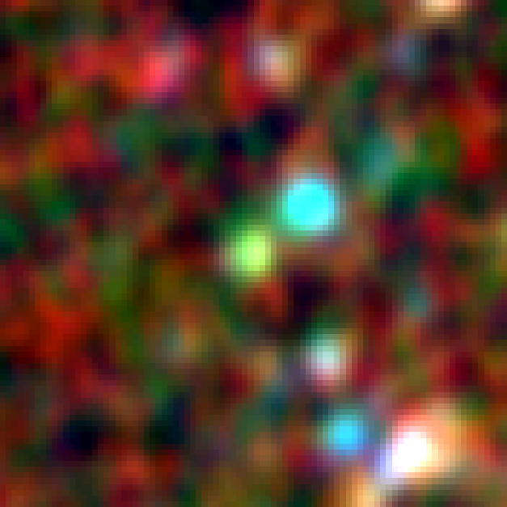

README
===

https://github.com/d80b2t/VHzQ

 Purpose
===
A repo that hosts investigating the highest (z>5) redshift quasars.

 Referencing
===
If you are referencing this repo, plus use::

Ross \& Cross, 2018, MNRAS, _in advanced prep_. 

 Plots and code
===

The plots and codes here are primarily based on data here::

    ~/data/highest_z_QSOs
    
and related directories are here and here::

    ~/Mbh_redshift/highz_growth

and here::

    ~/WW4C/VHzQs
    ~/WW4C/plots/VHzQs

 Also check-out::
===
     ~/programs/WW4C/plots
and 

     ~/programs/WW4C/plots/VHzQs

        

